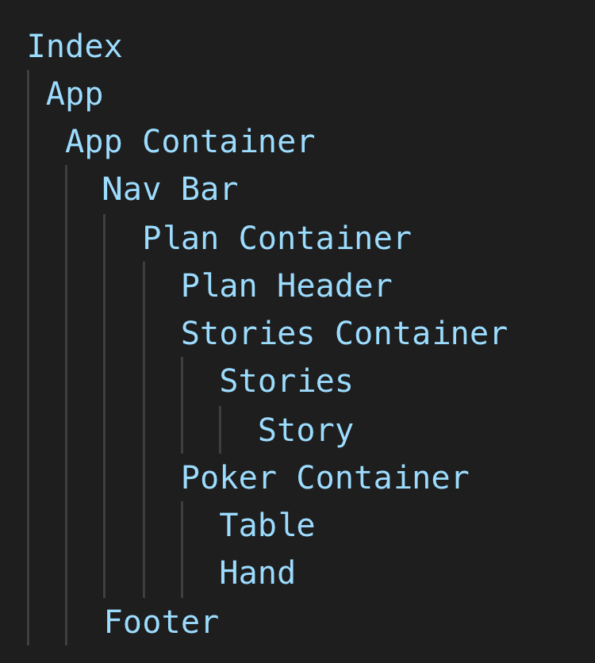

# What am I doing?

 My final FlatIron School project, the focus was put on tying things all together that I learnt, but with a particualr focus in using React and Redux to do something cool. 
 
I chose to make a tool that I have used physically but wanted a digital equivalent. Namely, planning poker.


 ## 'Hol' up, what Planning Poker?'

Let's give you the Wikipedia version because it sounds clever: 

 >Planning poker, also called Scrum poker, is a consensus-based, gamified technique for estimating, mostly used to estimate effort or relative size of development goals in software development. In planning poker, members of the group make estimates by playing numbered cards face-down to the table, instead of speaking them aloud. The cards are revealed, and the estimates are then discussed.

Put simply, with a bunch of people just discussing how long something will take, psychological factors start coming into play. Planning Poker is a technique to try and mitigate some of that.

I think being smart about estimating work saves a whole lot of heartache and stress so its definately something I wanted to will into the world.

I did find that there is already a site for this but it does limit features unless you pay. Plus its a bit faffy with user accounts. I wanted to make something more frictionless and easy to get going.


## Main features

At a high-level there were certain goals I wanted the app to do:

1. Create Plans that ...
2. Allow User Stories to be created which...
3. Team members can provide estimates via choosing a card that reflects.
4. That card will remain 'face down' till the Moderator turns them all over.
5. Capture the average scores for each story and the plan overall.
6. Generally make it easy for the team to see what is going on and contribue either as a moderator or team member.

That probably doesn't mean much so lets look at what I made before we dive into the technical details. (Sorry if you like things in cronological order!)

## The App's User Journey, in Pictures.

Here's a link to my video walkthrough which is even better than pictures. But hopefully this makes things clear:

1. Creating a plan


Nothing too hardcore here. We want to give the plan a name so people know what its all for. The Name is used in case the moderator also wants to play. The moderator PIN is the interesting one. Modelled after apps like Zoom, this replaces a traditional Admin Account system and provides admin level features to anyone who has, and enters, the pin.

2. Empty Plan


Once created we see the main page of the app. Using React Router, a unique URL is generated for the plan so that it can be shared with other team members. There is isn't much else going on till we...

3. Add Stories


A little form to create user stories quickly from the right hand panel. hopefully I have fixed that styling a little after I finished this blog post!

Soon as we have a story to work, then things get (relatively) exciting.

4. Estimating


Now two new containers have appeared. That allow estimations to happen on a story and see the results. 

The basic flow is as I have graffitied above. As long as the URL is shared, there is no limit to the number of people that can play. However, only those with the moderator PIN can perform the admin-y actions.


Overall its fairly straightforward, but with a few tricky things. But lets first discuss the trusty rails backend, the unsung (and unscreenshotted) hero.


## The Rails Backend Api

I used Rails generators for the most part to get things structured up. The basic concept is that:

**Plans** *have many* **Stories** *that have many* **Players**

Here are the migrations I created for each of those:

```rb
# Plans
class CreatePlans < ActiveRecord::Migration[6.0]
  def change
    create_table :plans do |t|
      t.string :name
      t.integer :pin
      t.string :url
      t.integer :selectedStory # Which Story is selected for this plan?
      t.timestamps
    end
  end
end

# Stories

class CreateStories < ActiveRecord::Migration[6.0]
  def change
    create_table :stories do |t|
      t.string :as_a   # I regret this naming convention
      t.string :want_to
      t.string :i_can
      t.integer :score
      t.boolean :revealed, :default => false # Are the scores revealed/face up?
      t.references :plan, foreign_key: true
      t.timestamps
    end
  end
end

# Players

class CreatePlayers < ActiveRecord::Migration[6.0]
  def change
    create_table :players do |t|
      t.string :name
      t.integer :score
      t.references :story, foreign_key: true
      t.timestamps
    end
  end
end
```

There are a few fields (namely selected_story and revealed) that have to exist because of the realtime multi-user nature of the app. The Story[:score] field is over engineered since a score can be derived from the players of that story. I learnt that later.

I created nested routes so that the api endpoints made sense, something like: `<root>/plans/<unique id>/stories/<story_id>`

The models and controllers mostly align to standard REST practises, with each action sending back datain JSON for things to be picked up by the Front End. So let's talk about... 


## React, Yay! 

I used create-react-app to get things going. The component tree is a little like this under the 'catch-all' App container:



With a few minor components thrown in. How does that relate to reality? Let me deface another screenshot:


## Views

So there is a whole bunch of views. If you know REST principles you can imagine what most of them do judging from the actions. But I will highlight a few more unique ones here:

### THAT Substitution form

The form logic is a little more complex since it needs to account for 4 variations:

- Existing Original Ingredient AND Existing Sub Ingredient
- Existing Original Ingredient AND New Sub Ingredient
- New Original Ingredient AND Existing Sub Ingredient
- New Original Ingredient AND New Sub Ingredient

With a simpler form, I would have the know how to lean back onto Rails helpers to build a substitution and its ingredient if needed. But a substitution and TWO different ingredients? 

MY current Rails knowledge requires me to be a bit more blunt:


```html
<% if @substitution.errors.any? %>
  <div id="error_explanation">
    <h3 class="error-text">
      <%= pluralize(@substitution.errors.count, "error") %>
      prohibited your substitution from being created:
    </h3>
 
    <ul>
    <% @substitution.errors.full_messages.each do |message| %>
      <li><%= message %></li>
    <% end %>
    </ul>
  </div>
<% end %>

<%= form_for @substitution do |s| %>

    <div class="form-section">
        <h2>Existing Original Ingredient</h2>
        <em>What are you swapping out?</em>
        <%= s.collection_select :original_id, Ingredient.ordered_by_name, :id, :name , :prompt => 'Select or add new Ingredient below' %><br>

            <h4> New original ingredient</h4>
            <strong>Ingredient:</strong>
                <%= s.fields_for :ingredient_original do |i| %>
                    <%= i.hidden_field :user_id, :value => current_user.id %>
                    <%= i.label :name %>
                    <%= i.text_field :name %>
                    <%= i.label :description %>
                    <%= i.text_field :description %>
                    <%= i.label :vegan %>
                    <%= i.check_box :vegan %>
                    <%= i.label :vegetarian %>
                    <%= i.check_box :vegetarian %>
                    <%= i.collection_select :category_id, Category.ordered_by_name, :id, :name, :prompt => 'Select or add a new Category' %>
                <% end %>
    </div>
            

        <div class="form-section">
        <h2>Substitution Ingredient</h2>
        <em>What are you swapping in?</em>
        <%= s.collection_select :sub_id, Ingredient.ordered_by_name, :id, :name, :prompt => 'Select or add new Ingredient below'%><br>
            <h4> New substitution ingredient</h4>
            <strong>Ingredient:</strong>
                <%= s.fields_for :ingredient_sub do |i| %>
                        <%= i.hidden_field :user_id, :value => current_user.id %>
                    <%= i.label :name %>
                    <%= i.text_field :name %>
                    <%= i.label :description%>
                    <%= i.text_field :description%>
                    <%= i.label :vegan %>
                    <%= i.check_box :vegan %>
                    <%= i.label :vegetarian %>
                    <%= i.check_box :vegetarian %>
                    <%= i.collection_select :category_id, Category.ordered_by_name, :id, :name, :prompt => 'Select or add a new Category' %>
                <% end %><br>
    </div>

    <div class="form-section">  
            <h2>Other Details</h2>
            <%= s.hidden_field :user_id, :value => current_user.id %>
            <%= s.label :same_quantity, "Should you use a 1:1 ratio?"%>
            <%= s.check_box :same_quantity %><br>
            <%= s.label :description, "Provide futher details if needed" %><br>
            <%= s.text_field :description %><br>
            <%= s.label :issues, "Any issues to consider?" %><br>
            <%= s.text_field :issues %><br>
            <%= s.submit "Submit Substitution" %>
    </div>
<% end %>
```


This esentially creates 'bespoke' params which I am forced to handle manually in the controller action. It works but I expect I will revisit this once I am informed 


### Here's my Card(s)

Because everyone on the internet likes doing it I decided to use shared partials to show Ingredients and Substitutions in little cards. The code for ingredient one looks like this:

```rb
# Ingredients Substitution Card
<div class="card">
            <div class="card-info">
                <% if i.substitutions.present? %>
                    <h3><%= link_to i.name, category_ingredient_path(c.id, i.id) %></h3>
                    <em><%= i.substitutions.size %> substitution(s) listed.</em>
                
                <% else %>
                    <h3> <%= i.name %> </h3>
                    <em>No Substitutions available, why not <%= link_to "add one?", controller:"substitutions", action: "new" %></em>
                <% end %>
            
                <p><%= i.description %></p>
            </div>
            <% if belongs_to_current_user(i) %>
                <div class="card-controls">
                <em><%= link_to "edit", edit_category_ingredient_path(c.id, i.id) %> </em> 
                <em> <%= link_to "delete", category_ingredient_path(c.id, i.id), :method => :delete %> </em> 
                </div>
            <% end %>
</div>

## The Ingredient Index View that calls it:
<h1><%= @category.name %> Ingredients</h1>
<em><%=link_to "Add", new_category_ingredient_path(@category.id)%> a new ingredient</em>

<div class="card-container">
    <% @category.ingredients.sort_by{|i| i.name}.each do |i| %>
        <%= render 'shared/ingredients_card',i:i, c: @category %>
    <% end %>
</div>
```

Why shared? Well I wanted:

1. Users to see thier own ingredients and substitutions on thier show page. 
2. Everyone to see there relevent ingredients and substitutions in a category. 

This reduces the amount of duplicated code floating around.

As well as the cards, I used partials for the forms to remove duplication from New and Edit routes. I also have a partial for flash messages. I suspect there is other refactors I can do in the app but these things always can be improved right?


# Wrapping up

My aim with this post is give you the edited highlights of how the app went from concept to reality. You can check it out [here](https://github.com/neosaurrrus/ingredient-substitutions). Clone it and have a play and see how it goes. But here are some pictures to tide you over:

The categories Index page:


The Ingredients Index page:


The Ingredient Show page showing the Substitutions:


The substitution form:


In making this app, I reinforced alot of the conceptual things I have learnt with a practical example. It also has given me a whole heap of extra things I would like to try adding.

In reality, apart from refactors and minor tweaks, the work required to make this app a real thing out in the world requires more time and love I can give it right now but maybe one day? I think the idea is a good one!
